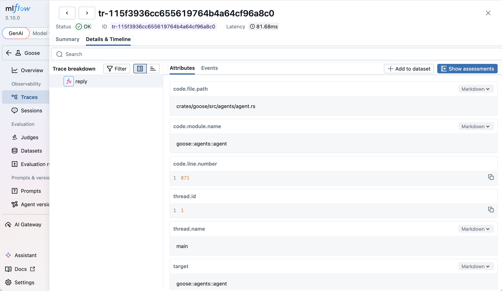

# Observability with MLflow

This tutorial covers how to integrate heybuddy with MLflow to trace your heybuddy sessions and understand how the agent is performing.

## What is MLflow

[MLflow](https://mlflow.org/) is an [open-source](https://github.com/mlflow/mlflow) platform for managing the end-to-end machine learning and AI lifecycle. MLflow Tracing provides detailed observability into AI agent execution, capturing LLM calls, tool usage, and agent decisions with a rich visualization UI.

## Why MLflow for heybuddy

- **Detailed trace visualization**: Inspect every LLM call, tool execution, and agent decision in a hierarchical trace view.
- **Token usage tracking**: Monitor input/output token counts and costs across sessions.
- **Evaluation framework**: Evaluate agent outputs using built-in LLM judges and custom scorers.
- **Prompt management**: Version and manage prompts used across your AI applications.
- **Open source**: Fully open-source with no vendor lock-in, self-host anywhere.

## Set up MLflow

Install MLflow and start the tracking server:

```bash
pip install mlflow
mlflow server --port 5000
```

The MLflow UI will be available at `http://localhost:5000`.

:::tip
For production use, configure a SQL backend store (PostgreSQL, MySQL) instead of the default SQLite. See the [MLflow documentation](https://mlflow.org/docs/latest/self-hosting/architecture/backend-store.html) for details.
:::

## Configure heybuddy to export OTLP to MLflow

heybuddy exports OpenTelemetry data over OTLP/HTTP. Point the exporter to MLflow's OTLP endpoint:

```bash
export OTEL_EXPORTER_OTLP_ENDPOINT="http://localhost:5000"
export OTEL_EXPORTER_OTLP_HEADERS="x-mlflow-experiment-id=0"
```

The `x-mlflow-experiment-id` header specifies which MLflow experiment to log traces to. Use `0` for the default experiment, or create a dedicated experiment:

```bash
pip install mlflow
mlflow experiments create --experiment-name "heybuddy-traces"
# Use the returned experiment ID in the header
```

To export only traces (disable metrics and logs export):

```bash
export OTEL_TRACES_EXPORTER=otlp
export OTEL_METRICS_EXPORTER=none
export OTEL_LOGS_EXPORTER=none
```

To include model messages and tool arguments/results in traces, explicitly enable
GenAI message content capture:

```bash
export OTEL_INSTRUMENTATION_GENAI_CAPTURE_MESSAGE_CONTENT=true
```

:::warning
Message content can contain sensitive data and produce large traces. Leave this
setting disabled unless your telemetry storage is appropriate for that data.
:::

## Run heybuddy with MLflow enabled

Start heybuddy normally. With the OTLP environment variables set, heybuddy will automatically export traces to MLflow:

```bash
heybuddy session
```

Open the MLflow UI at `http://localhost:5000` and navigate to the **Traces** tab to see detailed traces of your heybuddy session, including LLM calls, tool executions, and token usage.



## Learn more

- [MLflow Tracing documentation](https://mlflow.org/docs/latest/genai/tracing/)
- [MLflow OpenTelemetry integration](https://mlflow.org/docs/latest/genai/tracing/app-instrumentation/opentelemetry.html)
- [MLflow heybuddy integration guide](https://mlflow.org/docs/latest/genai/tracing/integrations/listing/goose.html)
